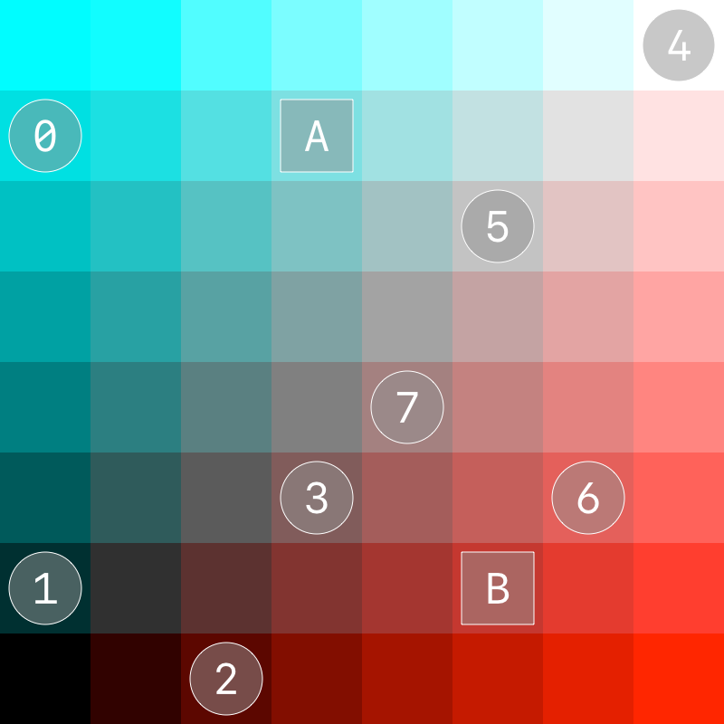
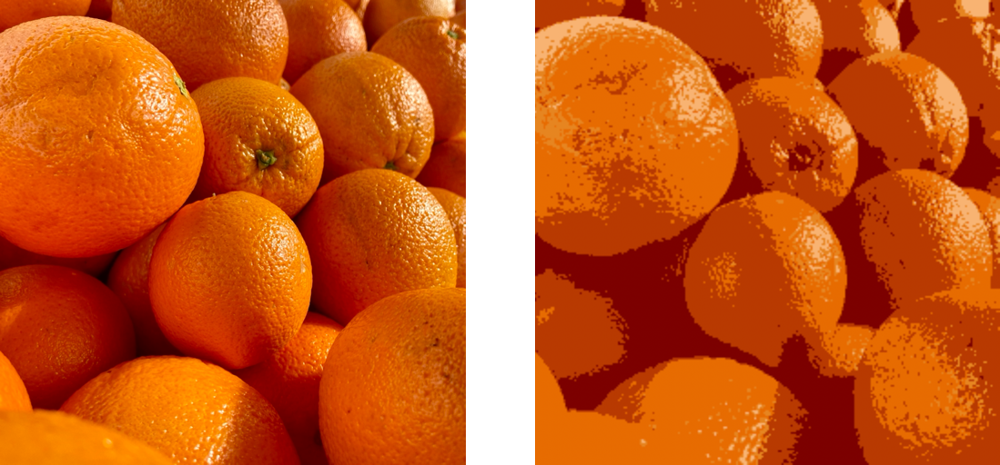

# Calculating the dominant colors in an image

Find the main colors in an image by implementing k-means clustering using the Accelerate framework.

## Overview

The Accelerate framework provides libraries that allow you to extract a specified number (`k`) of average colors in an image. This sample code app computes these colors using the _k-means algorithm_. The k-means algorithm finds the `k` dominant colors by `k` random centroids that define the centers of color clusters in the source image. The algorithm finds the closest colors to each centroid and updates each centroid to the average value of the closest colors. The process iterates over this step until the solution converges.

The image below shows the sample code app. The source image is on the left and a 3D point cloud of the color distribution is on the right. At the bottom of the image is a set of swatches that show the `k` dominant colors in the image.


Calculating the dominant colors in an image is useful for applications such as creating color palettes for GIF image creation. 

## Store the pixel values

The sample app stores the pixel values in [vImage.PixelBuffer](https://developer.apple.com/documentation/accelerate/vimage/pixelbuffer) structures with external storage. This approach ensures that the vImage library doesn't add any additional padding to the image rows that could interfere with the k-means clustering result. For more information about row padding, see [`vImage_Buffer`](https://developer.apple.com/documentation/accelerate/vimage_buffer).

``` swift
/// The storage and pixel buffer for each red value.
let redStorage = UnsafeMutableBufferPointer<Float>.allocate(capacity: dimension * dimension)
let redBuffer: vImage.PixelBuffer<vImage.PlanarF>

/// The storage and pixel buffer for each green value.
let greenStorage = UnsafeMutableBufferPointer<Float>.allocate(capacity: dimension * dimension)
let greenBuffer: vImage.PixelBuffer<vImage.PlanarF>

/// The storage and pixel buffer for each blue value.
let blueStorage = UnsafeMutableBufferPointer<Float>.allocate(capacity: dimension * dimension)
let blueBuffer: vImage.PixelBuffer<vImage.PlanarF>
```
  
 The [`init()`](x-source-tag://initClass) function initializes the three pixel buffers:
 
``` swift
redBuffer = vImage.PixelBuffer<vImage.PlanarF>(
    data: redStorage.baseAddress!,
    width: dimension,
    height: dimension,
    byteCountPerRow: dimension * MemoryLayout<Float>.stride)

greenBuffer = vImage.PixelBuffer<vImage.PlanarF>(
    data: greenStorage.baseAddress!,
    width: dimension,
    height: dimension,
    byteCountPerRow: dimension * MemoryLayout<Float>.stride)

blueBuffer = vImage.PixelBuffer<vImage.PlanarF>(
    data: blueStorage.baseAddress!,
    width: dimension,
    height: dimension,
    byteCountPerRow: dimension * MemoryLayout<Float>.stride)
```
  
The sample code app scales all images to `dimension * dimension` pixels.

## Initialize the cluster centroids

The [`KMeansCalculator.initializeCentroids()`](x-source-tag://initializeCentroids) function initializes the centroids from the red, green, and blue source pixels. The function initializes the first centroid as a random color in the source image.

``` swift
let randomIndex = Int.random(in: 0 ..< dimension * dimension)
centroids.append(Centroid(red: redStorage[randomIndex],
                          green: greenStorage[randomIndex],
                          blue: blueStorage[randomIndex]))
```
 
 The code below uses the distance from the previous centroid as a weight to initialize subsequent centroids. This ensures that centroids are distributed across the image colors.

``` swift
for i in 1 ..< k {
    distanceSquared(x0: greenStorage.baseAddress!, x1: centroids[i - 1].green,
                    y0: blueStorage.baseAddress!, y1: centroids[i - 1].blue,
                    z0: redStorage.baseAddress!, z1: centroids[i - 1].red,
                    n: greenStorage.count,
                    result: tmp.baseAddress!)
    
    let randomIndex = weightedRandomIndex(tmp)
    
    centroids.append(Centroid(red: redStorage[randomIndex],
                              green: greenStorage[randomIndex],
                              blue: blueStorage[randomIndex]))
}
```

## Calculate the distances between centroids and image colors

The [`KMeansCalculator.updateCentroids()`](x-source-tag://updateCentroids) function is responsible for updating the `k` centroids. The sample code app works in three dimensions with red, green, and blue as the axes. 

The first step that the sample code project takes is to calculate the distance in 3D RGB space between each color in the source image and each of the `k` centroids. Because the distances are used for comparisons only, the code below calculates the distance squared and avoids the overhead of calculating square roots:

``` swift
for centroid in centroids.enumerated() {
    distanceSquared(x0: greenStorage.baseAddress!, x1: centroid.element.green,
                    y0: blueStorage.baseAddress!, y1: centroid.element.blue,
                    z0: redStorage.baseAddress!, z1: centroid.element.red,
                    n: greenStorage.count,
                    result: distances.baseAddress!.advanced(by: dimension * dimension * centroid.offset))
}
```

The image below is an example 8 x 1 pixel image. The image's colors are such that the green and blue values in each color are the same. 


The following graphic shows a 2D representation of the distribution of the eight pixel colors in the small image above. The simplified version uses red as the horizontal axis and green-blue as the vertical axis. The illustration represents the eight pixel colors as circles and represents two centroids as squares. 

 

Given the following two rows represent the eight 2D colors:

```
[ 0.0, 0.0, 2.0, 3.0, 7.0, 5.0, 6.0, 4.0 ]    // Red color values for colors 0...7.
[ 6.0, 1.0, 0.0, 2.0, 7.0, 5.0, 2.0, 3.0 ]    // Green-blue color values for colors 0...7.
```

The following matrix shows the distances squared. The top row represents the distances to centroid _A_ and the bottom row represents the distances to centroid _B_:

```
[ 9.0, 34.0, 37.0, 16.0, 17.0,  5.0, 25.0, 10.0,        // For centroid _A_.
 50.0, 25.0, 10.0,  5.0, 40.0, 16.0,  2.0,  5.0 ]       // For centroid _B_.
```

## Calculate the closest centroid to each image color

The BNNS library's [`BNNS.ReductionLayer`](https://developer.apple.com/documentation/accelerate/bnns/reductionlayer) provides the [`BNNS.ReductionFunction.argMin`](https://developer.apple.com/documentation/accelerate/bnns/reductionfunction/argmin) reduction function that reduces the distances matrix to a vector that contains the index of the closest centroid for each color.

Before performing the reduction, the code below creates a [BNNSNDArrayDescriptor](https://developer.apple.com/documentation/accelerate/bnnsndarraydescriptor) structure that references the distances data so that the app doesn't perform a copy:

``` swift
func makeCentroidIndices() -> [Int32] {
    let distancesDescriptor = BNNSNDArrayDescriptor(
        data: distances,
        shape: .matrixRowMajor(dimension * dimension, k))!
    
    let reductionLayer = BNNS.ReductionLayer(function: .argMin,
                                             input: distancesDescriptor,
                                             output: centroidIndicesDescriptor,
                                             weights: nil)
    
    try! reductionLayer?.apply(batchSize: 1,
                               input: distancesDescriptor,
                               output: centroidIndicesDescriptor)
    
    return centroidIndicesDescriptor.makeArray(of: Int32.self)!
}
```

Using the simplified example above, the `centroidIndicesDescriptor` contains the following values after the code applies reduction:

```
[ 0, 1, 1, 1, 0, 0, 1, 1 ]      // 0 represents centroid _A_, and 1 represents centroid _B_.
```

## Gather the color data for each centroid

The sample code app uses the data in the `centroidIndices` array to gather the color data into vectors for each centroid.  For each centroid in the `centroids` array, the code below creates an array that contains the indices into the color arrays of the colors nearest to that centroid:

``` swift
let indices = centroidIndices.enumerated().filter {
    $0.element == centroid.offset
}.map {
    // `vDSP.gather` uses one-based indices.
    UInt($0.offset + 1)
}
```

For the 2D colors example, the `indices` array contains the following values:

```
[ 0,          4, 5 ]          // For centroid _A_.
[    1, 2, 3,       6, 7 ]    // For centroid _B_.
```

The [`vDSP.gather`](https://developer.apple.com/documentation/accelerate/vdsp/3600621-gather) function returns arrays that contain `indices.count` color values.

``` swift
let gatheredRed = vDSP.gather(redStorage,
                              indices: indices)

let gatheredGreen = vDSP.gather(greenStorage,
                                indices: indices)

let gatheredBlue = vDSP.gather(blueStorage,
                               indices: indices)
```

Using the simplified example above, the following shows the gathered red and green-blue values for the two centroids:

```
[ 0.0,               7.0, 5.0 ]             // Gathered red values for centroid _A_.   
[ 6.0,               7.0, 5.0 ]             // Gathered green-blue values for centroid _A_.

[     0.0, 2.0, 3.0,           6.0, 4.0 ]   // Gathered red values for centroid _B_.
[     1.0, 0.0, 2.0,           2.0, 3.0 ]   // Gathered green-blue values for centroid _B_.
```

The code updates each centroid with the average of their corresponding gathered colors:

``` swift
centroids[centroid.offset].red = vDSP.mean(gatheredRed)
centroids[centroid.offset].green = vDSP.mean(gatheredGreen)
centroids[centroid.offset].blue = vDSP.mean(gatheredBlue)
```

The following image shows the example 2D centroids after the update:

 

```
4.0    // Mean red value for centroid _A_.
6.0    // Mean green-blue value for centroid _A_.

3.0    // Mean red value for centroid _B_.
1.6    // Mean green-blue value for centroid _B_.
```

The code repeats these steps until the updates to each centroid fall within a specified tolerance. Once the centroid changes become negligible, the app treats the k-means process as converged.

## Generate a quantized image using the dominant colors

After the sample code app calculates the `k` dominant colors, it uses that data to quantize the source image. That is, the app replaces each color in the image with the color of the nearest centroid. 

The quantization step uses the [`BNNS.scatter`](https://developer.apple.com/documentation/accelerate/bnns/3972142-scatter) that performs an operation that's the inverse of the gather function the app uses for calculating k-means.

For each centroid, the sample finds the indices of the nearest colors and replaces the color values with that of the centroid:

``` swift
let indicesDescriptor = BNNSNDArrayDescriptor.allocate(
    initializingFrom: indices,
    shape: .vector(indices.count))

defer {
    indicesDescriptor.deallocate()
}

scatter(value: centroid.element.red, to: redQuantizedStorage)
scatter(value: centroid.element.green, to: greenQuantizedStorage)
scatter(value: centroid.element.blue, to: blueQuantizedStorage)

/// Scatters the repeated `value` to the `destination` using the `indicesDescriptor`.
func scatter(value: Float,
             to destination: UnsafeMutableBufferPointer<Float>) {
    let srcDescriptor = BNNSNDArrayDescriptor.allocate(repeating: value,
                                                       shape: .vector(indices.count))
    let dstDescriptor = BNNSNDArrayDescriptor(data: destination,
                                              shape: .vector(dimension * dimension))!
    
    try! BNNS.scatter(input: srcDescriptor,
                      indices: indicesDescriptor,
                      output: dstDescriptor,
                      axis: 0,
                      reductionFunction: .sum)
    
    srcDescriptor.deallocate()
}
```

The image below shows an original image of some oranges and the quantized version rendered with the five dominant colors:


